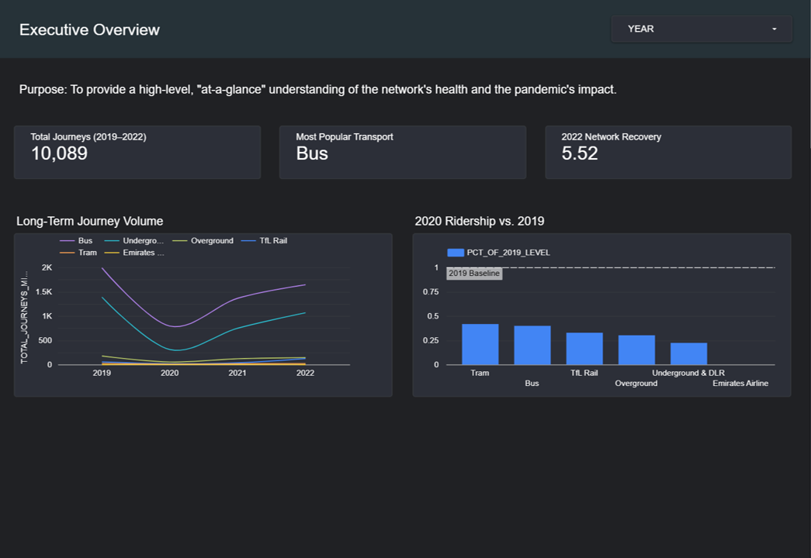

# London Transport Analysis: A Story of Resilience & Recovery

### 📊 [View the Interactive Dashboard Live Here](https://lookerstudio.google.com/s/hxPWljmELXY)

## Project Overview
This project is an end-to-end analysis of the Transport for London (TfL) public transport network, focusing on its response to and recovery from the COVID-19 pandemic. The entire data pipeline was built from the ground up in Snowflake, moving from raw, unstructured data to a strategic, interactive dashboard in Looker Studio that tells a clear data story.

The primary goal was to answer three core business questions:
1.  **The Big Picture:** What are the fundamental journey patterns and long-term trends of the TfL network?
2.  **The Shock:** How severely did the 2020 pandemic impact each mode of transport?
3.  **The Recovery:** How are the different services recovering toward pre-pandemic levels, and what new patterns have emerged?

---
## Tech Stack 🛠️
* **Data Warehouse:** Snowflake
* **Data Transformation & Modeling:** SQL
* **Business Intelligence & Visualization:** Google Looker Studio
* **Version Control:** Git & GitHub

---
## Live Dashboard Preview

---
## Data Pipeline Walkthrough

The project followed a modern ELT (Extract, Load, Transform) process within Snowflake.

### 1. Setup & Load
A dedicated database (`TFL_PORTFOLIO_DB`) and virtual warehouse (`TFL_PORTFOLIO_WH`) were created to isolate the project workload. The raw CSV data was loaded into a staging table (`JOURNEYS_STAGING`).

> **Why a Staging Table?**
> All columns in the staging table were intentionally set to `VARCHAR`. This is a defensive data loading strategy that ensures the initial load from a potentially messy source file never fails due to data type mismatches (e.g., an unexpected text string in a number column).

### 2. Transformation & Cleaning

A transformation script (`02_transform.sql`) was executed to clean the raw data and create a reliable, analytics-ready table (`JOURNEYS_PROD`). Here are the key transformations performed:

| Transformation | How It Was Done | Why It Was Done |
| :--- | :--- | :--- |
| **Data Type Conversion** | Used `TRY_TO_NUMBER()` and `TRY_TO_DATE()` functions. | **To convert text into usable formats.** Numbers are needed for calculations, and dates are needed for time-series analysis. The `TRY_` functions gracefully handle potential errors, converting faulty data to `NULL` instead of causing the entire query to fail. |
| **Handling Missing Values** | Used the `NULLIF(JOURNEYS_MILLIONS, '')` function. | **To ensure accurate aggregations.** The source data contained empty strings for missing journey data. Standard aggregate functions (`SUM`, `AVG`) can error on non-numeric types but correctly ignore `NULL` values. This step standardizes missing data as `NULL`, ensuring mathematical correctness. |
| **Creating a Production Table** | The cleaned data was loaded into a new table, `JOURNEYS_PROD`. | **To separate raw data from clean data.** This is a core principle of data engineering. The staging table acts as a transient layer, while the production table is the permanent, trustworthy source for all analysis. |

### 3. Analytical Modeling
To optimize the dashboard for performance and clarity, a semantic layer of four analytical views (`03_analysis_views.sql`) was built on top of `JOURNEYS_PROD`. These views pre-aggregate the data, so the dashboard performs calculations on small, summarized tables instead of the full, granular dataset. The key view, `V_RECOVERY_ANALYSIS`, joins yearly data with a 2019 baseline to calculate recovery percentages.

---
## Key Insights & Findings 💡
1.  **Massive Pandemic Impact:** In 2020, Underground & DLR ridership plummeted to just **25%** of 2019 levels. Buses, a more localized form of transport, were more resilient but still dropped to **52%**.
2.  **Uneven Recovery:** As of 2022, the network has recovered to **80%** of its pre-pandemic ridership. However, the recovery is uneven: TfL Rail (now part of the Elizabeth Line) has recovered the strongest, while Underground travel still lags.
3.  **Clear Seasonality:** The Emirates Airline cable car is clearly a tourist-focused service, with ridership consistently peaking in the summer months (June-August).

---
## How to Reproduce
The repository is structured for easy replication.
1.  Clone this repository: `git clone [Link to Your GitHub Repo]`
2.  Set up a Snowflake account.
3.  Execute the scripts in the `/sql` folder in numerical order. You will need to load the raw `tfl_journeys_final.csv` data into the `JOURNEYS_STAGING` table after running `01_setup.sql`.